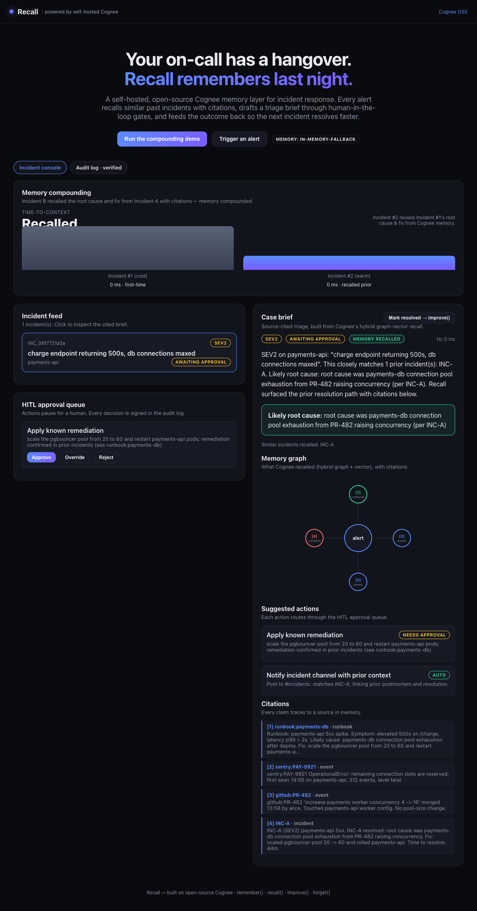
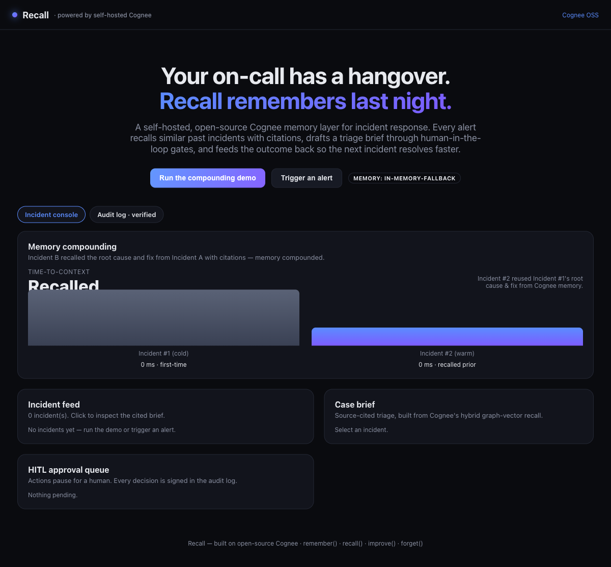
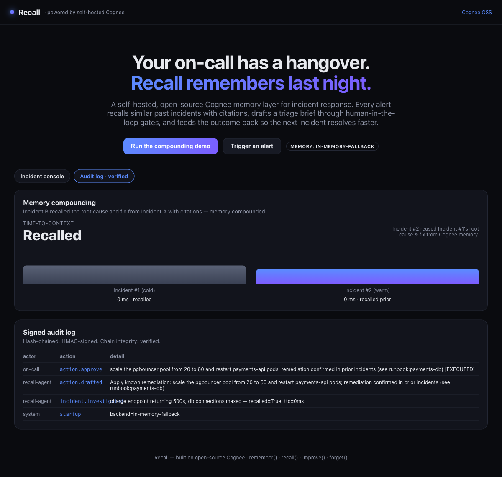

# Recall — Institutional Memory for On-Call & Incident Response

> Built on **self-hosted, open-source [Cognee](https://github.com/topoteretes/cognee)** for the WeMakeDevs x Cognee hackathon — **"Best Use of Open Source"** track.

Your on-call rotation has a hangover: every incident wakes up with no memory of the last one. The same outage gets re-debugged from scratch, the tribal knowledge walks out the door, and MTTR never improves.

**Recall** gives your incident response a permanent, self-hosted, hybrid graph-vector memory. It ingests incidents, postmortems, and runbooks into Cognee, and on every new alert it runs a cross-source investigation, **recalls similar past incidents**, and drafts a **source-cited triage brief** with suggested runbook steps. On-call approves/edits/overrides (human-in-the-loop), and after resolution the outcome is fed back via `improve()`/memify — so **the next similar incident resolves faster**.

The hero metric: **time-to-context shrinks across sessions.** Incident #2 instantly recalls "this looks like INC-001, root cause X, fix Y" with citations.

---

## Why this leans hard on Cognee (Best Use of Cognee)

Recall uses the **full Cognee memory lifecycle**, not just retrieval:

| Operation | Where Recall uses it |
| --- | --- |
| `remember()` / `add()` + `cognify()` | Ingest incidents, postmortems, runbooks, and source events into the hybrid graph-vector store |
| `recall()` | Hybrid graph + multi-hop traversal to find similar past incidents and build cited briefs |
| `improve()` / memify | Feed resolution outcomes + on-call feedback so memory compounds and the next incident resolves faster |
| `forget()` | Prune deprecated services and stale runbooks |

Everything runs **100% locally** on open-source Cognee (Postgres + pgvector + a graph backend). No Cognee Cloud required. (Cloud is supported only as a documented fallback via `cognee.serve(url=..., api_key=...)`.)

---

## Architecture

```
Alert/webhook ─▶ FastAPI orchestrator ─▶ Investigation agent ──recall()──▶ Cognee (graph + pgvector)
                                                │
                                                ▼
                                     Cited triage brief + runbook
                                                │
                                                ▼
                                       HITL approval queue
                                                │ approve / edit / override
                                                ▼
                                  Actions + signed audit log ──remember() outcome──▶ Cognee
                                                                                       │
                                                                          improve()/memify (compounding)
```

## Stack

- **Memory:** open-source `cognee` (self-hosted) — Postgres + pgvector + graph backend (Kuzu by default, Neo4j optional for visuals).
- **Backend:** FastAPI — webhook intake, investigation orchestration, HITL approval queue, signed audit log.
- **Frontend:** Next.js (App Router) — incident feed, cited case brief, live graph view, HITL gates, and a memory-compounding chart.

## Quickstart (100% local, open-source)

### Prerequisites
- Docker + Docker Compose
- An LLM API key (OpenAI by default) — Cognee extracts knowledge with an LLM
- Node 18+ for the frontend

### 1. Configure

```bash
cp .env.example .env
# edit .env and set LLM_API_KEY="sk-..."
```

### 2. Start the backend + memory layer

```bash
docker compose up --build
```

This starts:
- `postgres` (with pgvector) on `:5432` — the entire Cognee memory layer
- `backend` (FastAPI + self-hosted Cognee) on `:8000`

Optional graph visualization with Neo4j:

```bash
docker compose --profile neo4j up --build
```

### 3. Start the frontend

```bash
cd frontend
npm install
npm run dev
# open http://localhost:3000
```

### 4. Run the demo scenario

Seed the knowledge graph and replay incidents that prove memory compounds:

```bash
# from the UI: click "Run Demo", or via API:
curl -X POST http://localhost:8000/api/demo/seed
curl -X POST http://localhost:8000/api/demo/replay
```

You'll see Incident #2 resolve with full cited context that Incident #1 had to discover from scratch — that's Cognee memory compounding.

See [DEMO.md](DEMO.md) for the full 60-second walkthrough script. Put demo screenshots/video in `docs/screenshots/`.

### Screens

Cited case brief + memory graph (the alert hub linked to each cited memory node):



Memory compounding — Incident #1 (cold, first-time) vs Incident #2 (warm, recalled prior):



Signed, hash-chained audit log ("Chain integrity: verified"):



## Project layout

```
.
├── docker-compose.yml
├── .env.example
├── backend/                # FastAPI + self-hosted Cognee
│   ├── app/
│   │   ├── main.py
│   │   ├── memory.py       # Cognee lifecycle wrapper (remember/recall/improve/forget)
│   │   ├── agent.py        # Investigation agent -> cited brief
│   │   ├── hitl.py         # Approval queue
│   │   ├── audit.py        # Signed audit log
│   │   ├── demo.py         # Seed + replay scenario
│   │   └── models.py
│   ├── requirements.txt
│   └── Dockerfile
└── frontend/               # Next.js UI
```

## Open-source contribution side-track

This repo is packaged as a reusable Cognee incident-memory example. A PR to [`topoteretes/cognee`](https://github.com/topoteretes/cognee) / [`cognee-integrations`](https://github.com/topoteretes/cognee-integrations) is eligible for the separate $100/PR top-20 track (comment on an issue and wait for assignment first; max 5 PRs/person).

## Limitations & roadmap

For an honest accounting of what is real vs. placeholder/simulated (data
connectors, LLM synthesis, action execution, persistence, auth, etc.) and what is
yet to be built, see [LIMITATIONS.md](LIMITATIONS.md).

## License

Apache-2.0 (matching Cognee).
